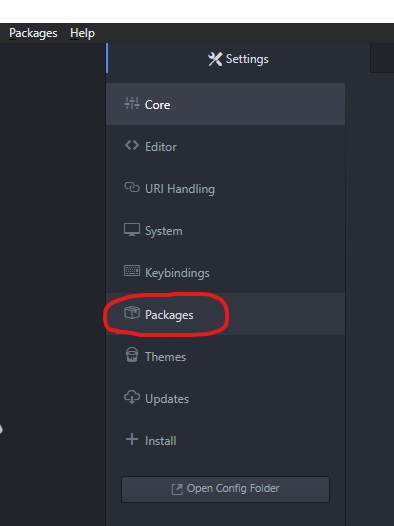

- [Introduction](#introduction)
- [Setup Atom to Utilize `require`](#setup-atom-to-utilize-require)
  - [Basic](#basic)
  - [Specific](#specific)
- [Directory Structure](#directory-structure)
  - [Top Level](#top-level)
  - [Subfolders](#subfolders)
    - [assets](#assets)
    - [counters](#counters)
    - [images](#images)
    - [scoring](#scoring)
    - [scrolls](#scrolls)
    - [setup](#setup)
    - [translators](#translators)
    - [utils](#utils)


# Introduction

The [Official Scholars mod by Garphill Games](https://steamcommunity.com/sharedfiles/filedetails/?id=2643607043) automated most, but not all, of the game setup, and had no scoring solution.  The [Scholars of the South Tigris (Improved US) mod](https://steamcommunity.com/sharedfiles/filedetails/?id=2946356787) was designed to improve the overall Player experience by not only addressing those limitations, but by adding several other quality of life improvements:

* Quick returns for Silver, Gold, Influence Markers, Workers, and White Dice
* Custom Shaped Bags for Silver, Gold, Workers, and Dice
* Counters for the Silver and Gold
* Turn order
* Flexibility of Player seating at any player count for either game mode
* Automating the Draft
* Automating the setup of the Solo Opponent
* Automating end game scoring

# Setup Atom to Utilize `require`

In order to support version control of the Lua scripting of the mod, the `require` function is utilized in order to bring in the code from an area on the developer's machine. The need for the code to be local is only required for development, and in no way impacts a general user of the mod.

## Basic

If you have never setup your Atom installation to utilize the `require` functionality, you will need to do that first before you can contribute to the mod.

1. Start by going to `File -> Settings`


2. Then from the resulting Settings dialogue click on `Packages`



3. From "Community Packages", click on `Settings` for tabletopsimulator-lua


4. Scroll down to the `Loading/Saving` submenu of Settings.
 
The value for `Base path for files you wish to bundle or #include` can be wherever you want on your system. I elected to put them in the same folder that Tabletop Simulator (TTS) uses for storing Mods and Saves; i.e.

> ~\OneDrive\Documents\My Games\Tabletop Simulator

After ensuring that the `require() other files` check box is selected, the last step is to set the `Bundle file patterns`. This should be 

> folder_name\\?.ttslua;folder_name\\?.lua;?.ttslua;?.lua;

where `folder_name` is the subfolder to the `Base Path` where you will be storing the various scriptting mod repos (and not one of the mod repos themselves). The `?` is simply the wildcard character that Atom utilizes.

e.g., my `folder_name` is "Tabletop Simulator Lua"  
> Tabletop Simulator Lua\\?.ttslua;Tabletop Simulator Lua\\?.lua;?.ttslua;?.lua;


## Specific

Assuming you already have your Atom IDE setup to work with `require`, then simply clone down the repo into a subfolder of the area that your Settings point to. The name of this subfolder needs to be "scholars", as that is what all the `require` commands in the mod assume. 

i.e.,

```
|-Base Path
    |-Folder Name used in Bundle file patterns
        |-scholars
```

Note: If you find a way for `require` to work with a variable path (e.g. `require(FOLDER_NAME .. "\setup\Turn Order")`), feel free to include that in your change set or message me about it. My own attempts lead to errors, so I begrudgingly accepted the hard-coded solution.

# Directory Structure

## Top Level

* Bags - contains the definitions of all bags in the game
* Fake Table - contains the Lua script for `onLoad` of the custom tile that serves as the "table" in game
* Global (Backup) - a manual copy of the contents of Global.-1.ttslua
* onLoad - the `onLoad` function used in Global.-1.ttslua


In order to avoid simply having a (somewhat unhelpful) single `require` statement in Global.-1.ttslua, it was decided to keep an unconnected copy of Global.-1.ttslua in the project. This allows people a natural looking point in order to find information on the mod (e.g. creator, git repo). It does have to be manually updated, but the benefits of availability outweighed the drawbacks of adding this manual process.

## Subfolders

### assets

Contains the obj file that serves as the model for the worker bags. This is different than the model for the workers themselves only in that its natural resting position is laying down.

URL to Model on the Steam Cloud:  
http://cloud-3.steamusercontent.com/ugc/2103802298702425963/D00C82150C7D5453A4DE87F5874A1843F72DE0DE/

### counters

Directory containing the Lua Scripts for the resource counters themselves, as well as the ability to create them in game.

### images

Directory containing any images necessary for this README or for use on the Description of the mod in the Workshop.

### scoring

Directory containing the functionality necessary for scoring a game.

### scrolls

Directory containing the definition of the metadata related to all Scroll Cards, as well as the functionality to rename the Scroll Cards should that prove necessary.

### setup

Directory containing the functionality for setting up a game; e.g., the Draft, establishing Turn Order, preparing the Scroll Card Draw Pile.

### translators

Directory containing the definition of the metadata related to all Translators, as well as the functionality to rename the Translators should that prove necessary.

### utils

Several modules that provide useful functionality that is not game specific, such as

* Extra math functions
* Extra functions for working with Lua Tables
* Quick Returns
